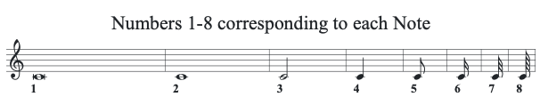

# Modified ABC Notation
A slight modification to the ABC Standard for musical notation.

For more information about the original ABC music notation, refer to [https://abcnotation.com](https://abcnotation.com)

## Demo
A widget demonstrating the modified ABC notation is available [here](https://paul-goodall.github.io/Modified_ABC_Notation/)

This widget makes use of the [ABCJS](https://www.abcjs.net) - an open source ABC music notation library, written by [Paul Rosen](https://github.com/paulrosen) and Gregory Dyke.

## Modifications to ABC Notation

There were a few things about the original ABC notation that I didn't love, and so I decided to create a wrapper to make things more intuitive for my own sake.  I've detailed each ammendment below.

To enable Modified-ABC notation, you must specify the header value:
E:modified

without this, the wrapper will ignore modifications and treat everything as Original-flavour ABC.

### 1. Simplicity of Note nomenclature.
I prefer to refer to notes as the appear on the Piano keys, where the first note is A0 and middle-C is C3.

This is more intuitive to me than using C for middle C, and then adding additional commas for octaves below, or apostrophes for octaves above.

### 2. Simplified note length
In Modified-ABC notation, the Crotchet or 1/4 note is always default.
Then, the usual notes are all referred to by number, starting with a Breve (1), then Semi-breve (2) and Minim (3) and Crotchet (4) and so on.  The diagram below is a reference.  This number is written before the note name.

e.g. 4d3 = a Crotchet (or Quarter note) on D3

e.g. 3f2 = a Minim on note F2 etc.

The same applies to rests, however the octave/pitch number is irrelevant, so I usually just write '0' for completeness.

e.g. 3z0 for a Minim rest, or 4x0 for an invisible Crotchet rest.

The rest of the ABC notation still applies for sharps and flats etc.

### 3. Words / Lyrics
Words can be added in the usual way, but on the same line as the voice notes:

e.g.

[V:1] 3z0  > 3d3 | 3d3 > ^4c35d3 | 3b4  > 3f3 | 3a4 3g3- | w: A dream is a wish your heart makes_

### 4. Voice switch

Voices can be switched on and off as follows:

Voice V:1 on
Voice V:2 off
etc.

OFF removes the voice from the Score.
